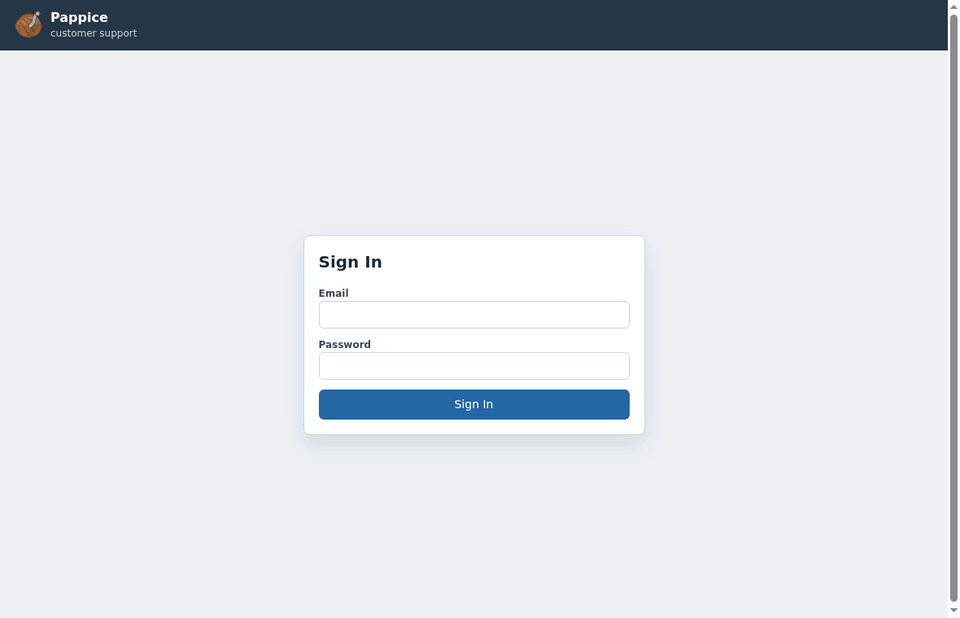

<p align="center">
  
</p>

# Pappice

Pappice is a small, self-hosted, chat-style support desk. Customers open tickets
from the portal; staff assign, reply, and track them.

It started as an internal tool for our small consultancy team and is currently
used in production to support multiple clients. It exists because the
alternatives we tried were either heavier than we wanted, not fully open
source, or missed the pieces we actually needed.



Pappice is intentionally minimal and self-contained:

- One Go binary with embedded web assets.
- SQLite storage plus an upload directory.
- No external database, queue, or frontend build step at runtime.
- Standard library first; the only direct Go dependency is the embedded SQLite
  driver.
- Linux release binaries around 12 MiB.
- Small production instance measured at roughly 20-30 MiB of RAM.

## Project Status

Pappice is in 0.x. It is used in production by a small team, but it has not been
externally security audited. The API and schema may change before a stable
release; existing installations can require `pappice db migrate` after a backup.

See [docs/architecture.md](./docs/architecture.md) for the current codebase
boundaries, persistence model, and change guidelines.

## Features

- Products group tickets by service, customer, or team.
- Customers and staff use the same UI with role-based actions.
- Ticket workflow: New, Assigned, Resolved, Rejected.
- Chat-style conversations with public replies, internal notes, unread state,
  assignees, priorities, filtering, and sorting.
- Drag/drop and pasted attachments, with inline image previews.
- Admin-created accounts with one-time setup/reset links or manual passwords.
- SMTP-backed no-reply notifications with a durable SQLite outbox.
- API tokens, webhooks, admin audit events, and a maintenance overview.

## Try Quickly

From a source checkout:

```sh
go run ./cmd/pappice demo
```

Or, after installing the release binary:

```sh
pappice demo
```

The demo starts a temporary HTTPS instance with sample users, product, tickets,
and replies. It prints the local URL and login credentials, and removes its
temporary data when stopped. Use `pappice demo -keep` if you want to inspect the
generated SQLite database and upload directory.

## Install And Deploy

For a persistent server, use [deploy/README.md](./deploy/README.md). It covers
release archives, environment files, nginx, systemd, Docker Compose, backups,
restore, and upgrades.

Release archives include the `pappice` binary and the deploy templates
referenced by that guide.

## Build From Source

Requires Go 1.26+.

```sh
go build -trimpath -o dist/pappice ./cmd/pappice
```

To create a release archive:

```sh
scripts/build-release.sh
```

Set `GOOS` and `GOARCH` for a specific target, for example
`GOOS=linux GOARCH=arm64 scripts/build-release.sh`.

Maintainers publish linux/amd64 and linux/arm64 archives with
`scripts/release.sh`; bump `VERSION` first because release tags are immutable.

## Configuration

Every runtime option is available as a flag and an environment variable.
Pappice loads `.env` from the working directory when present; process
environment variables win.

Important values:

- `PAPPICE_ADDR`: listen address, default `127.0.0.1:8388`
- `PAPPICE_DB`: SQLite database path, default `./pappice.db`
- `PAPPICE_TLS_CERT` / `PAPPICE_TLS_KEY`: HTTPS certificate and key
- `PAPPICE_TRUST_PROXY_HEADERS`: trust `X-Forwarded-*` headers from a private
  reverse proxy, default `false`
- `PAPPICE_PUBLIC_URL`: public HTTPS URL used in emails
- `PAPPICE_NOTIFICATION_DELAY`: ticket notification delay, default `30s`
- `PAPPICE_DOMAIN_EVENT_RETENTION`: processed event retention, default `720h`;
  `0` disables pruning
- `PAPPICE_SESSION_TTL`: browser session lifetime, default `336h`
- `PAPPICE_BRAND_NAME`: display name for the deployed instance
- `PAPPICE_UPLOAD_DIR`: directory for ticket attachments
- `PAPPICE_BACKUP_DIR`: directory where backup snapshots are stored

Use [.env.example](./.env.example) as the complete reference.

Useful local commands:

```sh
pappice db status
pappice db migrate --dry-run
pappice db migrate
pappice backup
pappice restore latest
pappice doctor
pappice version
pappice serve -h
```

`pappice serve` initializes a brand-new database, but it does not run migrations
for an existing database. If the schema is behind, run a backup, then
`pappice db migrate --dry-run`, then `pappice db migrate`.

`pappice doctor` validates paths, schema status, TLS, public URL, SMTP, upload
limits, rate limits, and development-only webhook settings.

## Branding

Set `PAPPICE_BRAND_NAME`, `PAPPICE_BRAND_SUBTITLE`, `PAPPICE_BRAND_MARK`, and
`PAPPICE_BRAND_COLOR` to brand a deployment without rebuilding the binary.

## Attachments

Ticket descriptions and replies can include files. Files are stored on disk in
`PAPPICE_UPLOAD_DIR`; SQLite stores only metadata and access rules. The UI
supports file picking, drag/drop, and paste. Back up the database and upload
directory together.

## Backup And Restore

Backups are local snapshots of the SQLite database plus the upload directory.
`pappice backup` uses SQLite's online backup API for a consistent database copy,
so it can run while Pappice is running.

```sh
pappice backup
```

This creates `PAPPICE_BACKUP_DIR/<timestamp>/` with `pappice.db`,
`uploads.tar`, and a manifest. The admin Maintenance page shows the backup
directory and latest detected backup.

Upload files are copied from the filesystem. A backup taken during an active
upload can include extra unreferenced files; stop Pappice first if you need a
strict database-and-upload snapshot.

Stop Pappice before restoring:

```sh
pappice restore pappice-backups/20260101T120000Z
```

Use `pappice restore latest` to restore the newest snapshot. Restore moves the
current database, WAL/SHM files, and upload directory into a
`restore-pre-<timestamp>` folder before replacing them.

## Deployment

Production installs use the release archive plus the `systemd`, nginx, and
environment templates in [deploy/](./deploy/README.md). The default production
shape is public HTTPS in nginx and local HTTP from nginx to Pappice on
`127.0.0.1:8388`.

Docker Compose deployment is available from a source checkout; see
`deploy/docker/` in the repository.

## Email

Pappice only sends no-reply email. It does not receive or parse replies.

Enable SMTP with:

```env
PAPPICE_EMAIL_NOTIFICATIONS=true
PAPPICE_PUBLIC_URL=https://support.example.com
PAPPICE_SMTP_HOST=smtp.example.com
PAPPICE_SMTP_PORT=587
PAPPICE_SMTP_USER=pappice
PAPPICE_SMTP_PASSWORD=secret
PAPPICE_SMTP_FROM=no-reply@support.example.com
PAPPICE_SMTP_TLS_MODE=starttls
```

Ticket notifications are queued in SQLite. Email and webhook delivery waits for
`PAPPICE_NOTIFICATION_DELAY`; pending updates for the same ticket are coalesced.
Admins can inspect the email outbox, send a test email, and retry failures from
the admin page.

## Webhooks And API

API access uses either the web session cookie or an API token:

```sh
curl -H "Authorization: Bearer pap_..." https://127.0.0.1:8388/api/tickets
```

Cookie-backed mutating requests must include the `X-Pappice-CSRF` token returned
by `GET /api/session`.

Webhook payloads are signed with `X-Pappice-Signature`. Supported ticket events:

- `ticket.created`
- `ticket.updated`
- `ticket.commented`
- `ticket.assigned`

Webhook secrets are created in `Admin -> Global Webhooks` or
`Products -> Webhooks`. Leave the secret field empty to let Pappice generate
one, then store the one-time value shown after creation or rotation.

Webhook URLs must be HTTPS and public by default. Development-only escape
hatches are available with `PAPPICE_ALLOW_INSECURE_WEBHOOKS` and
`PAPPICE_ALLOW_PRIVATE_WEBHOOKS`.

## Tests

E2E tests require Node, OpenSSL, and Chromium. Regenerating the README demo GIF
also requires `ffmpeg`.

```sh
go test ./...
npm run test:e2e
```

The E2E smoke test starts an isolated HTTPS Pappice instance with a temporary
SQLite database and fake SMTP server, then drives Chromium through the core
customer/staff ticket flow. Set `PAPPICE_E2E_CHROMIUM=/path/to/chromium` if
Chromium is not at `/usr/bin/chromium`.

Run the small memory benchmark with `npm run bench:small`. On this development
machine, the default scenario reported about 22 MiB RSS mean and 23 MiB RSS max
for 2 products, 2 staff sessions, 8 customer sessions, and 24 tickets. Treat
this as an indicative local measurement; compare runs on the same host.

For local profiling, build with `go build -tags debug ./cmd/pappice`, start
Pappice with `PAPPICE_DEBUG_ADDR=127.0.0.1:8390`, and use Go's standard
`/debug/pprof/` endpoints. The debug listener is disabled by default and only
accepts loopback addresses.

## Contributing

Keep changes small and focused. Run the tests above before opening a pull
request.

## License

Pappice is released under the GNU General Public License v3.0 only
(`GPL-3.0-only`). See [LICENSE](./LICENSE).

Copyright 2026 Paolo Marrone and contributors.
