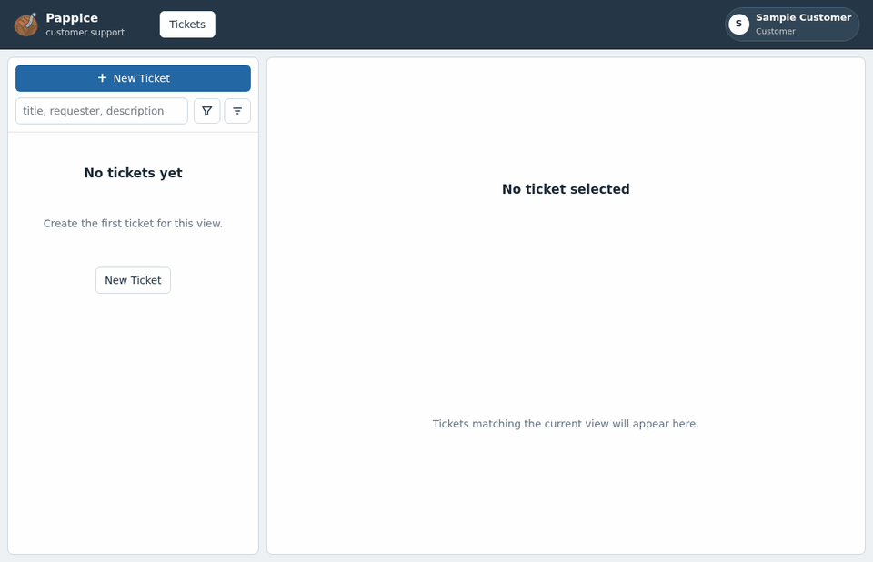

<p align="center">
  
</p>

# Pappice

Pappice is a small, self-hosted, chat-style support desk. Customers open tickets from the portal; staff assign, reply, and track them.

We built Pappice for our consultancy because the support desks we tried were too heavy, not fully open source, or missing the workflow we needed. We now use it in production across multiple clients.



Pappice is intentionally minimal and self-contained:

- One Go binary with embedded web assets.
- SQLite storage plus an upload directory.
- No external database, queue, or frontend build step at runtime.
- Standard library first; the only direct Go dependency is the embedded SQLite driver.
- Linux release binaries around 12 MiB.
- Small production instance measured at roughly 20-30 MiB of RAM.

Application source, excluding demos and tests (`npm run loc`; comments included):

| Backend | 12,877 LoCs |
| Frontend | 9,143 LoCs |

## Features

- Products contain tickets, with access controlled by [account types and product roles](./docs/access.md).
- Customers and staff use the same UI with role-based actions.
- Open/closed tickets with assignees, priorities, filters, and unread indicators.
- Chat-style conversations with public replies, internal notes, unread state, assignees, priorities, filtering, and sorting.
- File attachments via upload, drag/drop, or paste, with image previews.
- Admin-managed accounts with one-time setup/reset links or manually assigned passwords.
- optional SMTP-backed no-reply notifications with a durable SQLite outbox.
- [API tokens and webhooks](./docs/integrations.md), an admin audit log, and a maintenance view.

## Try Quickly

From a source checkout with Go 1.26+:

```sh
go run ./demo/native
```

The native demo uses local HTTPS with a self-signed certificate and sample data.
It prints the URL and credentials, and removes its data on shutdown. Use
`go run ./demo/native -keep` to retain the temporary directory.

For the experimental **browser-only demo**, Node 22+ is also required:

```sh
npm run demo:browser
```

Open `http://127.0.0.1:8389`. Each tab runs Go and SQLite locally; reloading resets
its data. All sections are available; file transfers and outgoing email/webhook
deliveries are unsupported.
To publish it, run `npm run build:browser` and serve `dist/browser/` on a static
host over HTTPS. Subdirectories work without route rewrites. Enable gzip or Brotli
for the WASM download; the build includes a precompressed `.wasm.gz` file.

## Project Status

Pappice is in 0.x and has not been externally security audited. API and schema
changes may require database migrations between releases.

## Install And Operate

Follow the [deployment guide](./deploy/README.md) for **Docker Compose (recommended)**
or binary + systemd. See [configuration](./docs/configuration.md) for optional settings.

## Build From Source

Requires Go 1.26+.

```sh
go build -trimpath -o dist/pappice ./cmd/pappice
```

Create a release archive with `scripts/build-release.sh`.

## Development

Run the local checks:

```sh
scripts/check.sh
```

Unsupported race checks and unavailable browser checks are skipped.
Set `PAPPICE_CHECK_STRICT=1` to require all checks; releases use strict mode.

Browser tests require Node 22+, OpenSSL, and Chromium or Chrome. Set
`PAPPICE_E2E_CHROMIUM=/path/to/chromium` to override discovery.
`npm run test:browser` checks the WebAssembly demo against a static host.

See [benchmarks](./benchmark/README.md) for reproducible memory measurements.

## Documentation

- [Architecture and change guidelines](./docs/architecture.md)
- [Security policy](./SECURITY.md)
- [Changelog](./CHANGELOG.md)

## Contributing

Keep changes small and focused. The checks above must pass before opening
a pull request.

## License

Pappice is released under the GNU General Public License v3.0 only
(`GPL-3.0-only`). See [LICENSE](./LICENSE).

Copyright 2026 Paolo Marrone and contributors.
